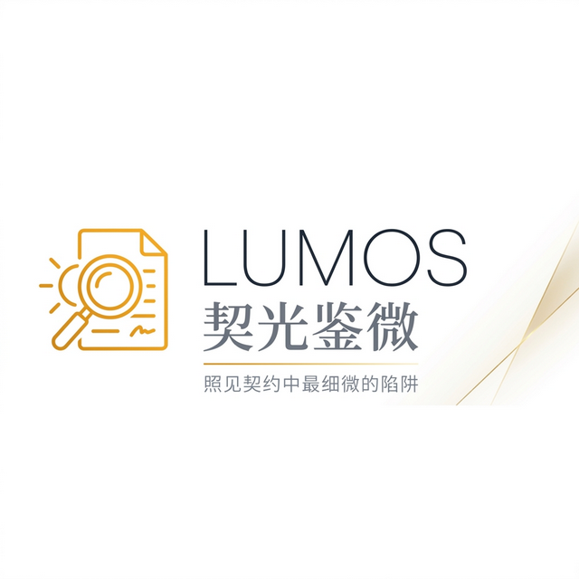

  

  <strong>开源 AI 合同风险排查助手 | 拍照即查 | 中国劳动法深度适配 | 完全免费</strong>

  
  
  

  <a href="#项目背景">项目背景</a> •
  <a href="#核心功能">核心功能</a> •
  <a href="#技术架构">技术架构</a> •
  <a href="./docs/technical-design.md">技术方案</a> •
  <a href="#快速开始">快速开始</a> 

---

## 📖 项目背景

> *"签了个合同，后来才发现有竞业禁止条款，离职后两年不能去同行，违约金还要赔 50 万。"*

每年有超过 **1200 万人** 进入中国就业市场。他们中的大多数人——尤其是应届毕业生和初入职场的年轻人——在签劳动合同时面临一个共同的困境：

- 开不出高昂的律师费（审阅一份合同通常收费 500-2000 元）。
- 看不懂晦涩的法律术语，不知道哪些条款暗藏玄机。
- 迫于入职压力，不敢对 HR 提供格式合同提出质疑。

现有的 AI 合同审查工具，几乎全部是为**企业法务和律师**设计的。

**Lumos · 契光鉴微** 就是要填补这个空白：
它是**第一个完全免费、开源、站在劳动者视角的 AI 合同风险排查助手**。用光，照见契约中每一个隐形陷阱。

 

## ✨ 核心功能

### 🔍 十大坑点智能检测
深度适配中国劳动法，自动扫描合同中最容易给员工挖坑的 10 类条款：

- **🔴 高危区**：离谱的竞业禁止 / 试用期不发社保、工资打骨折 / 变相强制扣薪。
- **🟡 警惕区**：含糊不清的岗位职责 / "服从公司一切安排" / 苛刻的离职审批。
- **🟢 关注区**：休假权益 / 管辖地争议等。

### 📸 极简输入模式
专为移动端场景优化，拿到纸质合同，**拍照即查**（集成端侧 OCR）；同时支持 PDF、Word 上传或直接粘贴合同片段。

### 💬 "说人话"的条款解读
拒绝术语堆砌。AI 会把复杂的条款翻译成你能听懂的「大白话」。
> _"本条款意味着你离职后两年内不能去同行。但由于没明确写补偿金标准，这是严重侵犯你权益的。根据劳动法，如果要签，公司必须每月补偿你离职前工资的 30%。"_

### 🗣️ 一键生成谈判话术
不只告诉你坑在哪，还教你怎么优雅地跟 HR 提要求。AI 会生成可以直接复制通过微信发送的专业话术，有理有据，不卑不亢。

 

## 🏗️ 技术架构

系统采用 **前后端分离** 的现代 Agent 架构，结合了移动端原生性能与后端强大的 AI 编排能力。

### 核心技术栈

| 架构层 | 技术方案 | 优势说明 |
|:---|:---|:---|
| **跨平台客户端** | Flutter (Dart) | 极致流畅的交互体验，一套代码覆盖 APP / Web。 |
| **端侧能力** | google_mlkit_text_recognition | 极致性能的端侧原生 OCR，首层数据脱敏保护隐私。 |
| **后端 API 网关**| Python + FastAPI | 极高并发，自带 OpenAPI 文档，类型提示完备。 |
| **AI 编排引擎** | LangGraph / PydanticAI | 纯正 AI 血统，支持复杂的「Agent 多节点思考与 RAG 工作流」。 |
| **数据与会话** | SQLite / PostgreSQL | 高效持久化，支撑大模型多轮上下文与案例积累。 |

> 详细的技术选型与架构设计，请参阅 [技术说明文档](./docs/technical-design.md)。

 

## � 快速开始

*(项目搭建中，敬请期待...)*

 

## 🤝 贡献与共建

Lumos 是一个为劳动者发声的公益开源项目，我们需要多元化的力量：
- ⚖️ **法律从业者**：帮助我们完善判例库、优化风险检测规则。
- 💻 **开发者**：提交 PR，优化系统性能与 UI 细节。
- � **每一个打工人**：分享你踩过的坑，让 AI 学习并保护更多人。

查看 [贡献指南](./CONTRIBUTING.md) 了解如何参与。

 

## ⚖️ 免责声明

**Lumos · 契光鉴微** 是一款基于人工智能的辅助审阅工具。系统检测结果与话术仅供参考，**不构成具有法定效力的专业法律建议**。对于标的额巨大或情况极其复杂的劳动争议，建议您线下咨询专业持证律师。

---

  <strong>✨ 照见契约中最细微的陷阱</strong>

  <small>Released under the <a href="./LICENSE">Apache 2.0 License</a>. Copyright © 2026 Lumos Contributors.</small>

